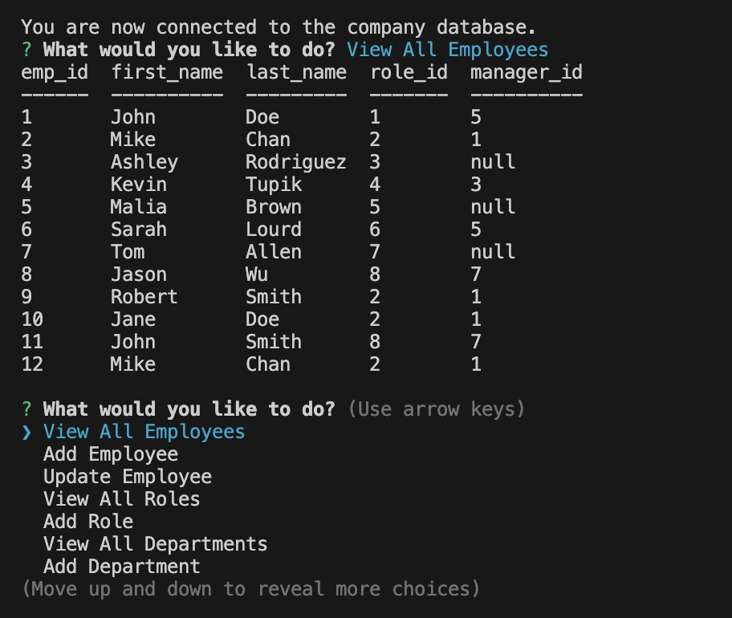

# Employee Tracker

Welcome to the Employee Tracker App! This user-friendly Node application is designed to manage an employee database using prompts in the CLI.

## Installation

To install this application, please follow the below instructions:
- Pull the repository files to your local machine
- Open the repository in your code editor of choice
- Open the terminal and run the command `npm install` to install the required dependencies
- Open Mysql in the CLI and run the command `source db/schema.sql` to create the database
- Run the command `source db/seeds.sql` to seed the database

## Usage

- Inside the terminal run the command `npm start` to start the application
- Follow the prompts to enter any information you wish to add or change
- You will have options to view, add, update, and delete employees, roles, and departments

## Demo
- [Check Out the Demo Video!]()

## Contributors
Adam Brannon

[Check out my repo](https://github.com/adam-brannon09)

[Email Me](mailto:adam.brannon09@icloud.com)

## Feedback and Support

If you encounter any issues while using the Employee Tracker or have any suggestions for improvement, please [open an issue](https://github.com/adam-brannon09/employee_tracker/issues) on the GitHub repository. I appreciate your feedback and will address any concerns as soon as possible.

## License

Employee Tracker is released under the [MIT License](https://opensource.org/licenses/MIT). You are free to use, modify, and distribute this application as per the terms of this license.

    

